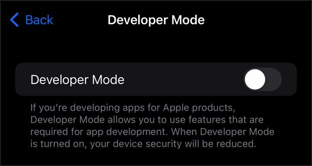

# Xcode-iOS-16.0-Developer-Disk-Images
iOS 16.0 Developer Disk Image for iPhoneOS

Uploaded from path: /Applications/Xcode.app/Contents/Developer/Platforms/iPhoneOS.platform/DeviceSupport/16.0/

## Enable Developer Mode

If you are using [libimobiledevice](https://github.com/libimobiledevice/libimobiledevice) to mount the disk images there is an extra step added with iOS 16. Developer Mode, introduced in iOS 16 and watchOS 9, protects people from inadvertently installing potentially harmful software on their devices, and reduces attack vectors exposed by developer-only functionality. 

Enable Developer Mode go to Settings > Privacy & Security on the iOS device. Scroll down to the Developer Mode list item and navigate into it. To toggle Developer mode, use the “Developer Mode” switch.

